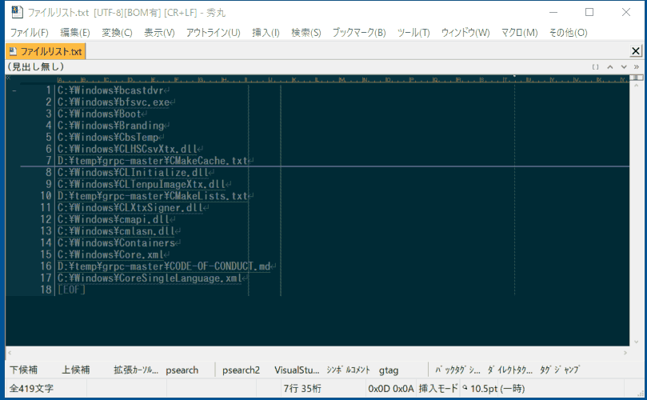
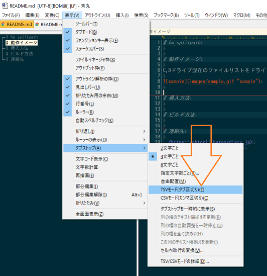
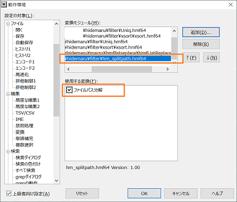

# hm_splitpath


[](https://opensource.org/licenses/MIT)

[](https://scan.coverity.com/projects/ohtorii-hm_splitpath)

# はじめに

これは、ファイルパスを4要素（※）に分解する[秀丸エディタ](https://hide.maruo.co.jp)の変換モジュールです。

（※）4要素

- ドライブ名
- ディレクトリ名
- ファイル名
- 拡張子名


# 動作イメージ

C,Dドライブ混在のファイルリストをドライブ名でソートする例です。



## TSVモード（タブ区切り）について

カラム毎にソートするため、事前に秀丸エディタをTSVモード（タブ区切り）へ変更しています。



# 動作詳細

```ファイルパス分解```拡張はファイルパスの要素毎にタブ文字(\t)区切りへ変換します。

## プログラマ向け補足

内部処理では、Microsoft提供の[_wsplitpath_s関数](https://docs.microsoft.com/ja-jp/cpp/c-runtime-library/reference/splitpath-wsplitpath?view=vs-2019)を呼び出しています。


# 導入方法

ご自分の環境に合わせて秀丸エディタのフィルターフォルダへコピーしてください。

|環境|拡張のファイル名|
|:--:|:--:|
|64bit版|hm_splitpath.hmf64|
|32bit版|hm_splitpath.hmf|



# 動作確認した環境

- Windows10 64bit
- 秀丸エディタ 64bit 8.92 β16
- 秀丸エディタ 32bit 8.91

# ビルド方法

この拡張をソースコードからビルドする手順は[README.md](https://github.com/ohtorii/hm_splitpath/blob/master/project/README.md)を参照してください。

# パフォーマンス

293万行（900MB）のファイルリストを1秒弱で処理します。  
シングルスレッド＆愚直アルゴリズムで実装しています。そのため、改善の余地は大いにありますが気が向かないため優先度は低いです😷

#### 計測に利用したCPU

Intel Core i7-9700@3.00GH


# 連絡先

- <https://ohtorii.hatenadiary.jp>
- <https://twitter.com/ohtorii>
- <https://github.com/ohtorii/hm_splitpath>
